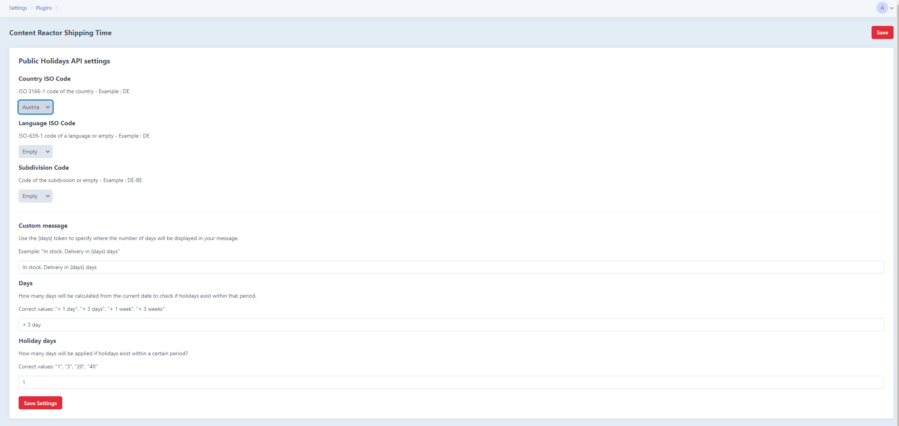

# Content Reactor Shipping Time

This configuration guide will help you set up the Content Reactor Shipping Time plugin by specifying various parameters such as country codes, language codes, and custom messages. Follow the instructions below to ensure proper configuration:

### 1. Country ISO Code
The ISO 3166-1 code of the country for which you want to retrieve public holiday data.
```bash
Example: DE (for Germany)
```
This field is required.
### 2. Language ISO Code
The ISO 639-1 code of the language in which the API response should be returned. If left empty, the default language will be used.
```bash
Example: DE (for German)
```
Leave this field empty if you do not want to specify a language.
### 3. Subdivision Code
The code of the subdivision (such as a state or province) for which you want to retrieve public holiday data. If left empty, the API will return holidays for the entire country.
Example: DE-BE (for Berlin, Germany)
Leave this field empty if you do not want to specify a subdivision.
### 4. Custom Message
A customizable message that includes a placeholder for the number of days until a holiday. Use the {days} token to specify where the number of days will appear in the message.
```bash
# token {days} - Number of days until a holiday
Example: "In stock. Delivery in {days} days"
```
### 5. Days
Specifies the period from the current date within which the API should check for public holidays. The value should indicate the number of days, weeks, or a combination of both.
```bash
# Correct Values:
"+ 1 day"
"+ 3 days"
"+ 1 week"
"+ 3 weeks"
```
### 6. Holiday Days
Specifies the number of holiday days to apply if holidays exist within the specified period.
```bash
# Correct Values:
"1"
"3"
"20"
"40"
```

## TLDR; 
Calculation of shipping time during holidays and non-holiday periods.

## Usage
Once the plugin is installed, you can display your custom message with the calculated shipping time. 

```bash
# This will print out the custom message with the calculated shipping time, can be used in any other template.
{{ calculateShippingTime }}
```

## Requirements

This plugin requires Craft CMS 4.8.0 or later, and PHP 8.0.2 or later.

## Installation

You can install this plugin from the Plugin Store or with Composer.

Please add this variable to your root .env file:
```bash
# 1. Open your root .env file.
# 2. Add the following line to the file:

HOLIDAY_API_BASE_URL="https://openholidaysapi.org/"
```
## Example



#### From the Plugin Store

Go to the Plugin Store in your project’s Control Panel and search for “Content Reactor Shipping Time”. Then press “Install”.

#### With Composer

Open your terminal and run the following commands:

```bash
# go to the project directory
cd /path/to/my-project.test

# tell Composer to load the plugin
composer require contentreactor/shipping-time

# tell Craft to install the plugin
./craft plugin/install content-reactor-shipping-time
```


